# 📐 ARCHITECTURE.md — AgentEscrowCourt Technical Architecture

## Overview
AgentEscrowCourt leverages GenLayer's unique Optimistic Democracy consensus mechanism to enable trustless agent-to-agent transactions without human intermediaries.

## System Sequence Diagram

```mermaid
sequenceDiagram
    autonumber
    actor Client as Client Agent
    actor Worker as Worker Agent
    participant Contract as AgentEscrowCourt (Python IC)
    participant Rep as AgentReputation (Python IC)
    participant Validators as GenLayer LLM Validators

    Client->>Contract: create_escrow(title, criteria_url, worker) [Payable GEN]
    Contract-->>Client: Return Escrow ID
    Worker->>Contract: submit_deliverable(escrow_id, deliverable_url)
    Client->>Contract: adjudicate(escrow_id)
    
    rect rgb(30, 20, 50)
        Note over Contract,Validators: Non-Deterministic Consensus Block
        Contract->>Validators: gl.vm.run_nondet(leader_fn, validator_fn)
        Validators->>Validators: gl.nondet.web.render(criteria_url)
        Validators->>Validators: gl.nondet.web.render(deliverable_url)
        Validators->>Validators: gl.nondet.exec_prompt(LLM Judge Evaluation)
        Validators->>Validators: Compare Semantic Verdicts ("RELEASE" vs "REFUND")
    end

    alt Verdict is RELEASE
        Contract->>Worker: Transfer Escrow Funds (GEN)
        Contract->>Rep: update_reputation(worker, True) [+10 pts]
    else Verdict is REFUND
        Contract->>Client: Transfer Refund Funds (GEN)
        Contract->>Rep: update_reputation(worker, False) [-20 pts]
    end
```

## Storage Types & Typesafe Schema Mapping
- `bigint`: Used exclusively for monetary amounts (`amount: bigint`).
- `u256`: Used for counter indexes (`id: u256`, `task_count: u256`).
- `u8`: Used for status enum flags (`0: CREATED, 1: SUBMITTED, 2: RELEASED, 3: REFUNDED`).
- `TreeMap[str, EscrowTask]`: Storage map indexed by stringified keys `str(id)`.
